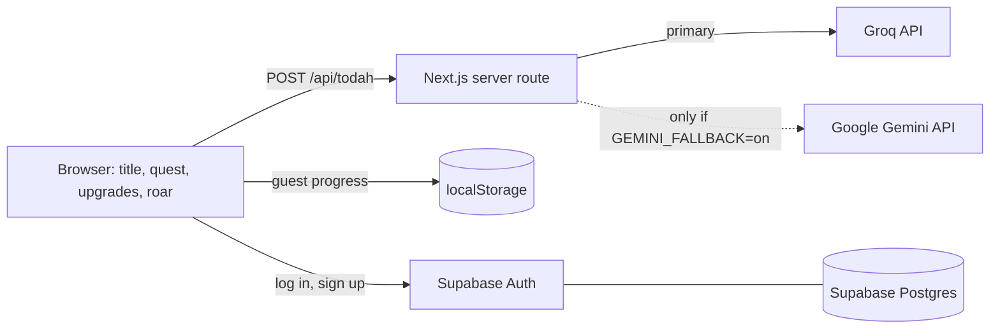
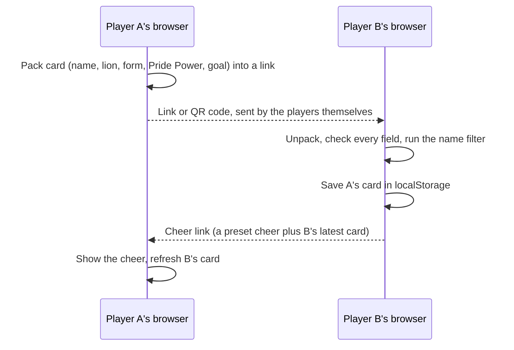
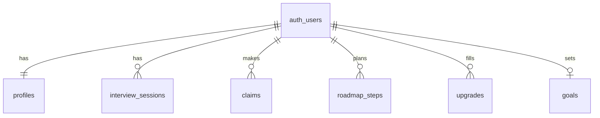

# RWR architecture

Single Next.js (TypeScript, App Router) app. No separate backend service.

- LLM keys live only on the server (`.env.local` locally, host environment variables when deployed).
- The browser never calls an LLM directly.
- With no key set, or when both providers fail, the quest uses scripted lines from `lib/lines.ts`.

## Progression

- **Trail map** (`/map`, `lib/compass.ts`): each Ikigai circle is scored 0 to 3. The player
  writes a claim and ticks the evidence that is true of it; a claim with no evidence scores 0.
  The map shows the strongest and thinnest circle and one real-world step for the thinnest. It
  never ranks careers.
- **Level interviews** (`/level/heart`, `/level/craft`, `/level/cause`, `/level/coin`, `components/LevelQuest.tsx`): a scripted opener, then
  three follow-ups from `/api/todah` in `interview` mode. The server counts the answers, tells
  the model which follow-up it is on, and ends the level after the fourth answer. Each
  follow-up looks for one of the circle's three kinds of evidence (`levelBriefs` in
  `lib/prompts.ts`). A second call in `summary` mode returns a small JSON form, a claim and
  three true-or-false answers, which the server checks field by field. The player edits that
  form and only then is it saved to the trail map. If the AI is off, down, or returns
  anything unexpected, the level falls back to scripted questions and an empty form. All four
  levels share this one component: a level is its brief in `lib/prompts.ts` and its lines.
- **Crossroads** (`/crossroads`, `components/CrossroadsScreen.tsx`): opens once every circle
  has a claim. One call in `crossroads` mode sends the four claims and their evidence counts
  and gets back a short message: what lines up, one gap, one open question. The prompt
  forbids naming careers or giving advice. The message is saved with the claims it was about,
  so it is asked for again only if they change. Then the player sets `goalText`, the goal the
  roar waits on. Without the AI the message is built from the strongest and thinnest circle.
  Before the goal, Todah says two things the diagram gets wrong if read too literally: the
  four circles do not all have to live in one job (in Pew's 2021 survey of 17 countries,
  family ranked above occupation as a source of meaning almost everywhere), and a thin circle
  is not a dead end (O'Keefe, Dweck and Walton, 2018: people who see interests as developed,
  not found, stay interested when a subject gets hard).
- **Todah remembers**: in `interview` mode the browser also sends the claims already on the
  map from the other circles, the first Quest 1 answer (Heart only) and up to two friends'
  witness answers (Craft only). `readMemory` in the route scrubs and trims them, and
  `levelPrompt` asks Todah to pick up a thread on his first follow-up and in his closing
  words, and never to re-ask what he already knows. It costs no extra AI calls.
- **The road** (`/road`, `components/RoadScreen.tsx`): the player names an obstacle. One call
  in `road` mode returns JSON (an if-then plan and three experiments, each tied to a circle),
  checked field by field like the level summary, and the player edits it before it is saved
  as `progress.road`. If their words show distress the model returns `care: true` and the
  screen stops planning and responds with care. Doing an experiment opens a check-in: one
  call in `checkin` mode, one reply from Todah, then that circle's evidence boxes for the
  player to update. The first experiment done for a circle counts as that circle's trail
  step (2 Pride Power). The if-then plan follows research on mental contrasting with
  implementation intentions (Oettingen and Gollwitzer).
- **A friend's witness** (`/witness`, `lib/witness.ts`): built like My Pride. The question
  link carries the lion's card id, the player's first name and the lion's name. The answer
  link carries the card id, the friend's first name and up to 200 characters. Both sit in
  the URL fragment, every field is validated and run through the name filter, and an answer
  is kept only if its card id matches the lion in play. It is an honour system.
- **Todah's note** (`/letter`, `components/LetterScreen.tsx`, `lib/letterImage.ts`): opens
  only once `goalAchievedAt` is set. One call in `letter` mode sends the player's words in
  order (the first Quest 1 answer, the four claims, friends' witness answers, the goal, the
  obstacle and plan, and what they reported about each experiment) and gets back the middle of
  a note of about 90 words. The game adds the greeting and signature, so the player's name is
  never sent. The server then removes the quotation marks from any quote that is not really
  in the player's words, and asks once more if the note runs long. The model is asked to
  think only lightly for this call: asked to think harder it has used its whole allowance
  thinking and returned nothing. Without the AI the note is assembled from the player's own
  words. It is saved as `progress.letter` and can be rewritten twice.
  The note is drawn on a canvas in the browser: wood grain, paper fibres, fold creases and
  the inked paw print are made from seeded random strokes, the text is set in a handwriting
  font, and the lion is the player's own pixel lion (coat colour worked out pixel by pixel
  with `lib/colour.ts`) enlarged eight times with the Scale2x edge-rounding method and given
  a soft-focus copy underneath. The same picture is what the screen shows and what is saved
  or shared, as a JPEG. The words are also in the image's alt text and offered as plain text.
- **Sharing the free AI** (`lib/limit.ts`): the provider's free tier is one daily budget for
  all players. Before each AI reply the route checks a daily count kept in an HttpOnly cookie
  (a date and a number, nothing about the visitor; 60 a day) and a per-minute count per
  network address held in memory (20 a minute). Past either, the route answers 429 and the
  game carries on from scripted lines. Clearing cookies resets the daily count: a limit that
  could not be reset would need a stored row per visitor, which the game chooses not to
  keep. Token counts per call are logged (numbers only) to watch the budget. A full
  playthrough is now about 26 AI replies, plus one per experiment reported.
- **Lion upgrades** (`/upgrades`, `lib/upgrades.ts`): every slot has three checks, one per
  level, that look at what the entry says (a second sentence, a result with a number, proof in
  brackets) and not at its length.
- **Den** counts career paths: lions that have a main goal and at least 3 evidence points.
- **Pride** counts connections: friends in My Pride and outreach the player logs
  (self-reported). Levels need 3, 10 and 25. With no accounts this is an honour system.
- **Pride Power** runs to 50: 21 from the seven slots, 12 from trail map evidence, 10 from
  real-world trail steps (2 each), and 7 from one-off milestones (finish Quest 1, set a goal,
  write all four claims, send a cheer, and the roar, worth 3). `powerParts` in
  `lib/progress.ts` holds the sum.
- **Wardrobe** (`/wardrobe`, `lib/accessories.ts`): sparks come from levels walked (5 each), cheers received (1 each,
  once per friend per day, only from someone in the pride) and interviews logged (25 each).
  They buy accessories, one worn per category. Guests can look but only a signed-in player
  can own or wear them, and the crown is a gift for the roar alone. `LionAvatar` draws the seated sprite and the
  accessories on one 51 by 64 grid, so they line up at any size. Fur colours are CSS filters
  over the sprite. The mane is its own layer (`lib/maneArt.ts`, generated to fit the sprite's
  outline) in four sizes: its size follows the Mane upgrade's level and its colour is the one
  thing a purchase changes. Each accessory has colour options, passed around as `id~colour`
  tokens, so a friend's card shows the same outfit.
- **Matching sets** (`lib/colour.ts`, `setMane` in `lib/accessories.ts`): every fur has a mane
  of the same name. Its two colours are the natural mane's colours put through that fur's
  filter (the same maths the browser uses), so each set repeats the golden cub's own scheme:
  the mane is the coat's colour a step round the wheel, deeper and stronger. It also matches
  the tail tip the filter has already tinted on the sprite. Fur and mane are bought
  separately, so a new fur alone does not match until its mane is bought too. Three manes
  (white, purple, teal) belong to no set. The mane layer is drawn only from Mane level 1 up.
- **Picture pieces**: accessories marked `image` in `lib/accessories.ts` are PNGs in
  `public/wardrobe`, one per colour (`<id>--<colour>.png`), the size of the lion's stage with
  only the piece on it. `LionAvatar` draws them as SVG images in `drawOrder` (a costume
  first, then shoes and jackets, what hangs over them, and last what sits on the face and
  head), mixed in with the older letter-drawn pieces. `scripts/wardrobe-from-sheet.py` makes
  them: it registers each sheet cell's lion against the game's sprite by outline, keeps the
  pixels whose colour is not found there or next to it, and repaints the piece from the
  shared ramps in `scripts/wardrobe_manifest.py`, giving each pixel a ramp step by its rank
  from dark to light. One palette for every piece is what makes any combination sit together.
  A piece with `hidesMane` (the shishi transformation) replaces the lion's own mane.
- **Several lions**: NEW GAME sets the game in play aside (`rwr.lions.v1`) and starts another.

## Accounts

- `lib/account.ts` keeps one watcher on the Supabase session and feeds every screen.
- **Forgotten passwords**: "Forgot password?" in the login box (and CHANGE PASSWORD on
  `/privacy`) asks Supabase to email a reset link. The link logs the player in and Supabase
  reports a password recovery, and `AccountWatch` (in the layout) opens the new password box
  on whatever page they land. The reply is the same whether or not the email has an account.
  In the Supabase dashboard (Authentication, URL Configuration) the Site URL must be the live
  site, and the Redirect URLs must include the live site and `http://localhost:3000`.
- **Dev account**: an account marked `dev` in its app metadata gets a DEV chip and the dev
  tools at `/dev`. App metadata is set by the project owner in Supabase, and a player cannot
  set it on themselves. Dev tools are stored with the lion in play (`progress.dev`): unlock
  every accessory, choose the mane size, choose the form. They change looks and ownership only
  and never add to Pride Power. For guests, and on any account that is not a dev account,
  `AccountWatch` switches them off. Like the rest of the game's progress this is checked in
  the browser, so it guards against accidents, not against someone editing their own saved game.

## My Pride (friends without a backend)

- The card sits after the `#` in the link, which browsers do not send to any server, so the
  RWR server never sees it. Nothing about friends is stored in the database.
- Cheers are a fixed list in `lib/lines.ts`, so a link cannot carry a custom message.
- Links are untrusted input: `lib/pride.ts` validates types and lengths and drops anything the
  name filter refuses.
- Trade-off: a friend's card is a snapshot. It refreshes when they share again or send a cheer.

## Privacy by design

- Todah asks for consent before the first AI call. Without it, the quest runs from scripted
  lines entirely in the browser.
- The player's name is never sent to the server. The AI writes a `[NAME]` token and the browser
  fills it in.
- Email addresses, links, and phone numbers are scrubbed from answers before they reach a provider
  (`lib/scrub.ts`).
- The server route does not log or store answers.
- `/privacy` lets a player turn off saving on the device and delete all of their data.

## Database

Schema: `supabase/migrations/`. Every table has row level security so a player can only read
and write their own rows. There is no transcript table: what players type to Todah is never
stored in the database.

Status: the schema is applied to the Supabase project, but account progress is not synced to the
database yet. Progress is saved in the browser (localStorage) for guests and accounts alike.
