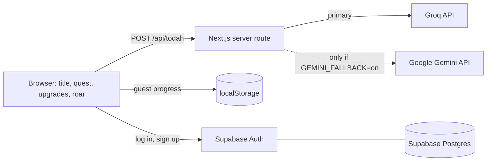
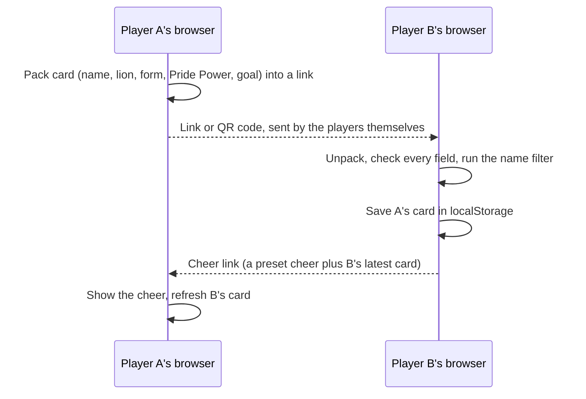
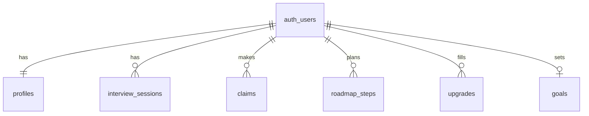

# RWR architecture

Single Next.js (TypeScript, App Router) app. No separate backend service.

- LLM keys live only on the server (`.env.local` locally, host environment variables when deployed).
- The browser never calls an LLM directly.
- With no key set, or when both providers fail, the quest uses scripted lines from `lib/lines.ts`.

## Progression

- **Trail map** (`/map`, `lib/compass.ts`): each Ikigai circle is scored 0 to 3. The player
  writes a claim and ticks the evidence that is true of it; a claim with no evidence scores 0.
  The map shows the strongest and thinnest circle and one real-world step for the thinnest. It
  never ranks careers.
- **Lion upgrades** (`/upgrades`, `lib/upgrades.ts`): every slot has three checks, one per
  level, that look at what the entry says (a second sentence, a result with a number, proof in
  brackets) and not at its length.
- **Den** counts career paths: lions that have a main goal and at least 3 evidence points.
- **Pride** counts connections: friends in My Pride and outreach the player logs
  (self-reported). Levels need 3, 10 and 25. With no accounts this is an honour system.
- **Pride Power** runs to 50: 21 from the seven slots, 12 from trail map evidence, 10 from
  real-world trail steps (2 each), and 7 from one-off milestones (finish Quest 1, set a goal,
  write all four claims, send a cheer, and the roar, worth 3). `powerParts` in
  `lib/progress.ts` holds the sum.
- **Wardrobe** (`/wardrobe`, `lib/accessories.ts`): sparks come from cheers received (5 each,
  once per friend per day, only from someone in the pride) and interviews logged (25 each).
  They buy accessories, one worn per category. Guests can look but only a signed-in player
  can own or wear them, and the crown is a gift for the roar alone. `LionAvatar` draws the seated sprite and the
  accessories on one 51 by 64 grid, so they line up at any size. Fur colours are CSS filters
  over the sprite. The mane is its own layer (`lib/maneArt.ts`, generated to fit the sprite's
  outline) in four sizes: its size follows the Mane upgrade's level and its colour is the one
  thing a purchase changes. Each accessory has colour options, passed around as `id~colour`
  tokens, so a friend's card shows the same outfit.
- **Several lions**: NEW GAME sets the game in play aside (`rwr.lions.v1`) and starts another.

## My Pride (friends without a backend)

- The card sits after the `#` in the link, which browsers do not send to any server, so the
  RWR server never sees it. Nothing about friends is stored in the database.
- Cheers are a fixed list in `lib/lines.ts`, so a link cannot carry a custom message.
- Links are untrusted input: `lib/pride.ts` validates types and lengths and drops anything the
  name filter refuses.
- Trade-off: a friend's card is a snapshot. It refreshes when they share again or send a cheer.

## Privacy by design

- Todah asks for consent before the first AI call. Without it, the quest runs from scripted
  lines entirely in the browser.
- The player's name is never sent to the server. The AI writes a `[NAME]` token and the browser
  fills it in.
- Email addresses, links, and phone numbers are scrubbed from answers before they reach a provider
  (`lib/scrub.ts`).
- The server route does not log or store answers.
- `/privacy` lets a player turn off saving on the device and delete all of their data.

## Database

Schema: `supabase/migrations/`. Every table has row level security so a player can only read
and write their own rows. There is no transcript table: what players type to Todah is never
stored in the database.

Status: the schema is applied to the Supabase project, but account progress is not synced to the
database yet. Progress is saved in the browser (localStorage) for guests and accounts alike.
