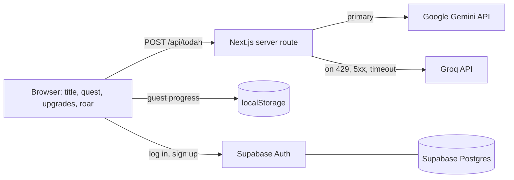
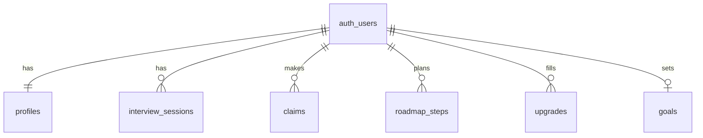

# RWR architecture

Single Next.js (TypeScript, App Router) app. No separate backend service.

- LLM keys live only on the server (`.env.local` locally, host environment variables when deployed).
- The browser never calls an LLM directly.
- With no key set, or when both providers fail, the quest uses scripted lines from `lib/lines.ts`.

## Privacy by design

- Todah asks for consent before the first AI call. Without it, the quest runs from scripted
  lines entirely in the browser.
- The player's name is never sent to the server. The AI writes a `[NAME]` token and the browser
  fills it in.
- Email addresses, links, and phone numbers are scrubbed from answers before they reach a provider
  (`lib/scrub.ts`).
- The server route does not log or store answers.
- `/privacy` lets a player turn off saving on the device and delete all of their data.

## Database

Schema: `supabase/migrations/`. Every table has row level security so a player can only read
and write their own rows. There is no transcript table: what players type to Todah is never
stored in the database.

Status: the schema is applied to the Supabase project, but account progress is not synced to the
database yet. Progress is saved in the browser (localStorage) for guests and accounts alike.
